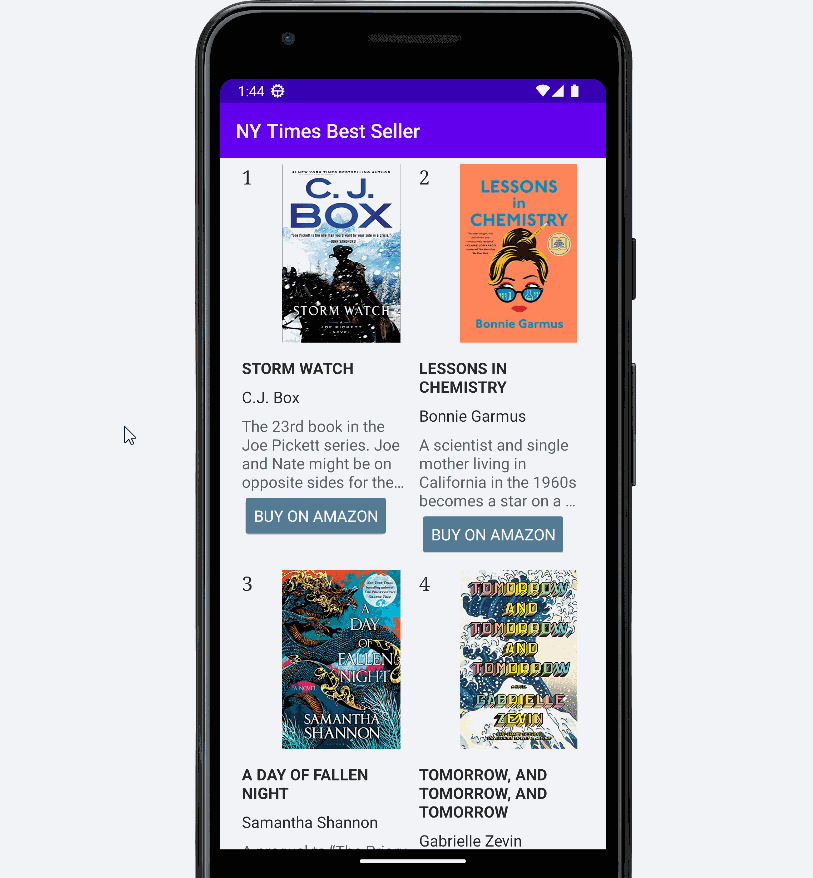

# Android Lab 3 - NY Times Bestselling Books

## Required Features

- [x] Live data is loaded from the NY Times API
- [x] Books are displayed using a RecyclerView
- [x] Book cover images are downloaded and displayed using Glide
- [x] Stretch Features

The stretch features will help develop this app into something closer to the NY Times website.

- [x] View elements are styled in the .xml files
- [x] The "Buy" button successfully opens the page on Amazon

